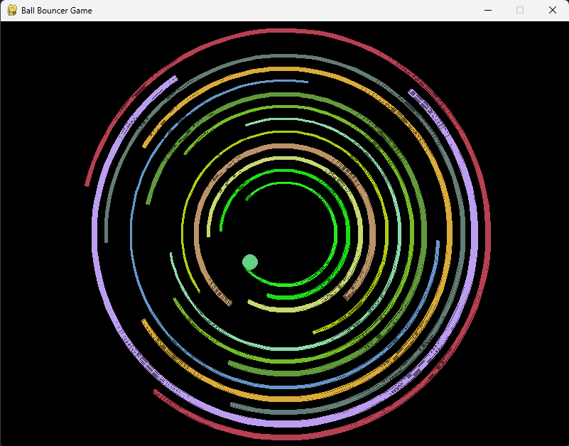

# **Ball Bouncer Game**

The Ball Bouncer game features a ball that continuously moves within rotating boundaries, driven by gravity, speed variations, and random bounce adjustments after each collision. The boundaries rotate and change their angles, interacting with the ball in dynamic ways. When the ball escapes all arcs, new random configurations are applied, such as the number of boundaries, their radius, rotation speed, width, and color. This ensures the game never stops and provides a fresh, unpredictable challenge each time the ball escapes the arcs.



---

## **Table of Contents**
- [**Ball Bouncer Game**](#ball-bouncer-game)
  - [**Table of Contents**](#table-of-contents)
  - [**Features**](#features)
  - [**Installation**](#installation)
    - [**1. Clone the Repository**](#1-clone-the-repository)
    - [**2. Set Up a Virtual Environment**](#2-set-up-a-virtual-environment)
    - [**3. Install Dependencies**](#3-install-dependencies)
  - [**Usage**](#usage)
  - [**Project Structure**](#project-structure)

---

## **Features**
- **Continuous Ball Movement:** The ball constantly moves, influenced by gravity, speed adjustments, and random bounce variations.
- **Rotating Boundaries:** Boundaries rotate with varying speeds and angles, providing dynamic interactions with the ball.
- **Endless Gameplay:** The game never stops;  Each time the ball escapes all arcs, new boundary configurations are applied, including the number, size, speed, width, and color of the boundaries.
- **Elastic Bounce Mechanics:** The ball bounces off boundaries with elasticity, creating unpredictable yet consistent behavior.

---

## **Installation**
Follow these steps to set up and run the project:

### **1. Clone the Repository**
```bash
git clone https://github.com/thisisaqib/ball_bouncer.git
cd ball_bouncer
```

### **2. Set Up a Virtual Environment**
```bash
python -m venv venv
source venv/bin/activate  # On Windows: venv\Scripts\activate
```

### **3. Install Dependencies**
```bash
pip install -r requirements.txt
```

## **Usage**
To run the game:

```bash
python src/main.py
```

When running, you will see:

- A ball bouncing within a rotating boundary.
- Collision sounds when the ball interacts with certain regions.

## **Project Structure**
```bash
ball_bouncer/
├── src/
│   ├── ball_bouncer/      # Main application package
│   │   ├── __init__.py    # Package-level initialization
│   │   ├── config.py      # Configuration constants
│   │   ├── ball.py        # Ball logic
│   │   ├── boundary.py    # Boundary logic
│   │   └── game.py        # Game entry point
│   └── __init__.py        # Ensures `src` is treated as a package
├── docs/
│   ├── images/            # Images for documentation (e.g., screenshots)
├── assets/                # Game assets (sounds, images, etc.)
├── requirements.txt       # List of dependencies
├── pyproject.toml         # Project metadata and build configuration
├── .gitignore             # Files to ignore in source control
├── README.md              # Project overview and documentation
└── LICENSE                # License file for open-source projects
```

